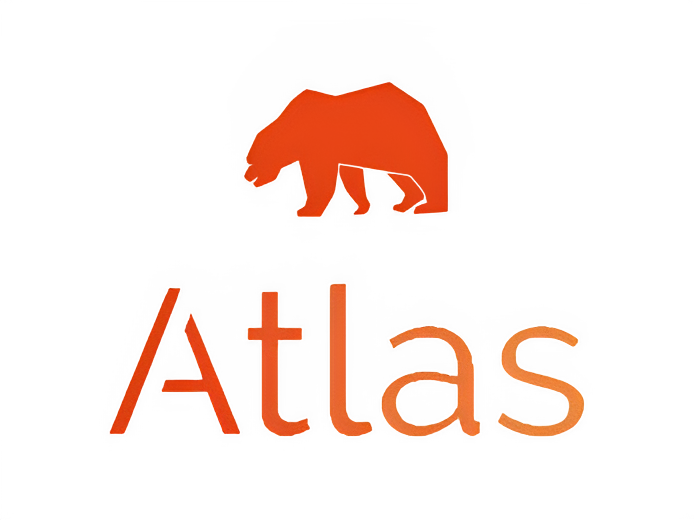

---

## Table of Contents 📚
- [Overview](#overview)
- [Features](#features)
- [Installation](#installation)
- [Usage](#usage)
- [Contributing](#contributing)
- [License](#license)
- [Acknowledgements](#acknowledgements)

---

## Overview 🌐

Atlas is a next-generation financial app designed to give you a comprehensive and clear picture of your financial future. By leveraging powerful analytics and customizable portfolios, Atlas helps you make data-driven decisions for long-term financial growth.

---

## Features 🔥

- **Custom Portfolios**: Create and manage multiple portfolios with various asset types, including stocks, bonds, and cryptocurrencies.
  
- **Advanced Projection**: Utilize our state-of-the-art algorithms to see future performance of your portfolio.
  
- **Risk Assessment**: Our risk assessment tools offer real-time insights into the potential risks and rewards.
  
- **Real-time Market Data**: Stay updated with the latest market trends and news.
  
- **Interactive Dashboards**: Our dashboards are not just informative but also interactive, offering you full control over how you view your data.
  
- **Dividend Tracking**: Understand your earnings better with our comprehensive dividend tracking feature.

---

## Installation 💻

```bash
# Clone the repository
git clone https://github.com/hunterjsb/atlas.git

# Navigate into the directory
cd atlas

# Install dependencies
pip install -r requirements.txt

# Start the app
streamlit run ./src/projections.py`
```
